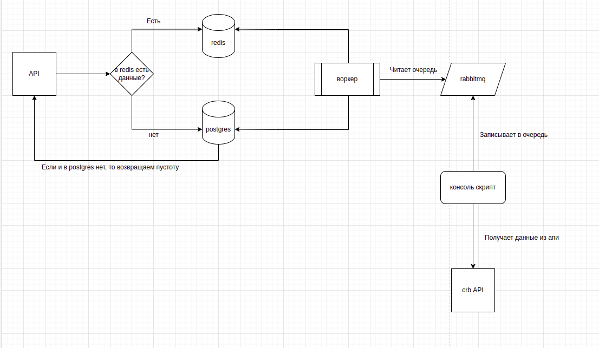
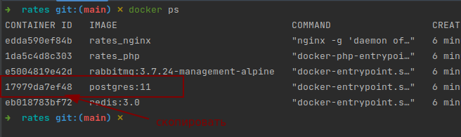
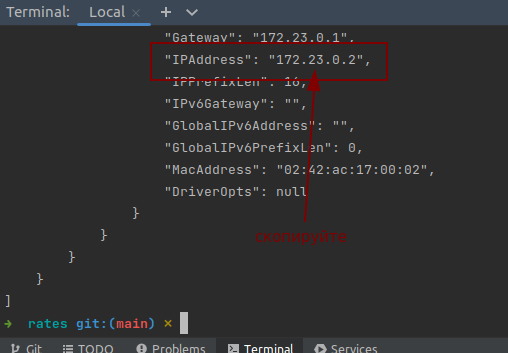
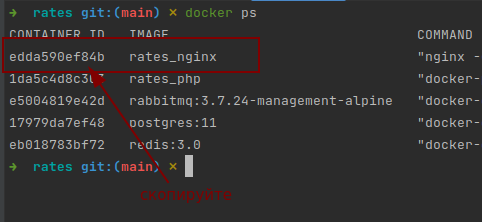
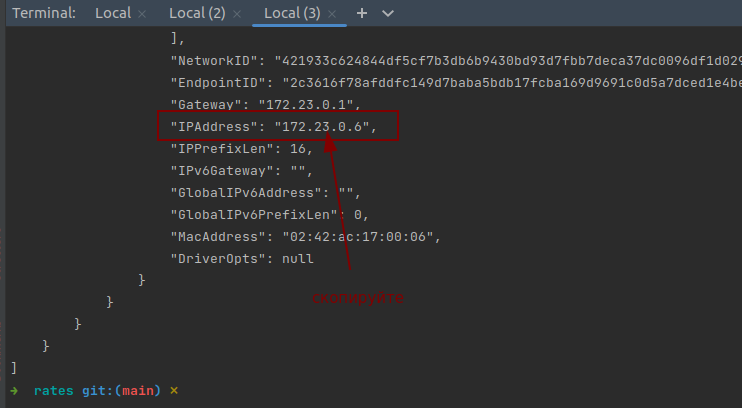
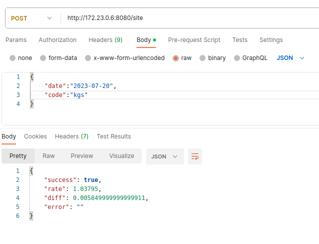

# Rates

## Содержание
* [Архитектура](#архитектура)
* [Установка и настройка](#установка-и-настройка)
* [Выполнить yii команды через докер](#выполнить-yii-команды-через-докер)
* [API](#API)

# Архитектура


# Установка и настройка

```bash
$ git clone git@github.com:Dilbar97/rates.git

- в корне проекта найдите файл .env.example
- скопируйте этот файл, вставьте там же и переименуйте копию на .env

$ docker-compose up -d --build
$ composer install
$ docker ps
  - скопируйте ID(хеш) postgres контейнера(скрин 1)
$ docker inspect {ID(хеш) postgres контейнера}
  - скопируйте поле IPAddress(скрин 2)
  - скопированный ip address вставьте в поле POSTGRES_HOST в файле .env
```
Скрин 1


Скрин 2



# Выполнить yii команды через докер

```bash
$ docker exec -it rates_php_1 bash
  - запустите эту команду в двух вкладках терминала
$ php yii migrate/up
  - запустите эту команду в любой из двух вкладок
$ php yii rates/consume 
  - запустить эту команду во второй вкладке терминала. 
    Эта команда прочитает все данные из очереди и запишет их в постгрес и редис
$ php yii rates 180
  - запустить эту команду в первой вкладке терминала. 
    Эта команда запустит процесс получения данных из crb за указанный период дней и запишет всё в очередь
```

# API

```bash
*** В новой вкладке терминала
$ docker ps
  - скопируйте ID(хеш) nginx контейнера(скрин 3)
$ docker inspect {ID(хеш) nginx контейнера}
  - скопируйте поле IPAddress(скрин 4)
```
Скрин 3


Скрин 4



 - В Postman создайте POST вкладку и пропишите на примере следующего: 
    http://{IPAddress(из скрин 4)}:8080/site 
 - В body укажите слудующие данные:
```
   {
       "date":"2023-07-20",
       "code":"kgs"
   } 
```
 - В ответе должно вернуться следующее:


